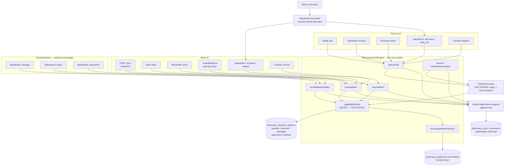

# Inventory Architecture — Phase 4

**Date:** 2026-09-11
**Scope:** Pharmaceutical distribution inventory, stock, batch, expiry, FEFO, stock control
**Status:** Code complete in both repos and type-checked. **Not deployed.** The automated test suite has not been executed — see `INVENTORY_TESTING.md`.
**Source of truth for this document:** the files listed in §12. Every statement below is traceable to one of them. Anything that could not be verified from code is marked *unverified*.

This document supersedes the "recommended architecture" section of `INVENTORY_AUDIT.md` wherever the two differ. Section §13 lists every place the delivered code diverges from that audit so the audit can be reconciled.

---

## 1. The one authoritative stock model

```
Branch → Warehouse → Product (medicine) → Batch → State
```

Nothing in the system holds stock at any other granularity.

| Level | Table | Key columns | Role |
| --- | --- | --- | --- |
| Branch | `pops_branches` | `id`, `code` | Security and reporting boundary. Resolved from `branchCode` by `StockAvailabilityService.resolveBranch` (`stock-availability.service.ts:77`). Medicines are branch-scoped. |
| Warehouse | `pharmacy_warehouses` | `organization_id`, `branch_id`, `code`, `is_default` | Physical location inside a branch. Validated against the resolved branch by `resolveWarehouse` (`stock-availability.service.ts:94`). |
| Product | `pharmacy_medicines` | `sku`, `current_stock`, `reorder_level`, `min_stock`, `max_stock`, `batch_tracking_enabled`, `fefo_enabled` | Catalogue row. `current_stock` is a **cache only** (§3). |
| Batch | `pharmacy_medicine_batches` | `medicine_id`, `warehouse_id`, `batch_number`, `expiry_date`, quantity columns | **The source of truth for quantity.** |
| State | columns on the batch row | `quantity`, `reserved_quantity`, `damaged_quantity`, `quarantine_quantity`, `blocked_quantity` | Buckets are separate columns and are never merged. |

Batch `warehouse_id` is a bare `uuid` with **no foreign key** (`packages/database-pg/src/schema/pharmacy.ts:77`), and pre-Phase-4 rows have it `NULL`. That legacy shape is handled explicitly everywhere rather than being migrated away — see §9.

---

## 2. The exact definitions of the stock numbers

These are copied from `StockAvailabilityService.stockExpressions` (`api/src/pharmacy/inventory/stock-availability.service.ts:112-134`). They are the only definitions in the system; the same SQL fragments are reused by the stock list, the dashboard, the product page, the availability API and the transfer availability gate.

Two helper predicates are used below:

```sql
active    := lower(coalesce(batches.status, 'active')) = 'active'
unexpired := batches.expiry_date >= current_date
```

| Number | Exact expression | Meaning |
| --- | --- | --- |
| `physicalQty` | `SUM(quantity + reserved_quantity + damaged_quantity + quarantine_quantity + blocked_quantity)` | Every unit in the building, whatever state it is in. |
| `availableQty` | `SUM(CASE WHEN active AND unexpired THEN quantity ELSE 0 END)` | Free to sell right now. |
| `reservedQty` | `SUM(reserved_quantity)` | Physically present but promised to a document. |
| `damagedQty` | `SUM(damaged_quantity)` | Physically present, not sellable, still valued. |
| `quarantineQty` | `SUM(quarantine_quantity)` | Held pending inspection or release. |
| `blockedQty` | `SUM(blocked_quantity)` | Administratively blocked, including expired stock moved out by an `expiry` adjustment. |
| `expiredQty` | `SUM(CASE WHEN expiry_date < current_date THEN quantity ELSE 0 END)` | Derived from the date. **Not a stored bucket.** |
| `onHoldQty` | `SUM(CASE WHEN NOT active THEN quantity ELSE 0 END)` | Units sitting in `quantity` on a batch whose hold flag is not `active`. |
| `nearExpiryQty` | `SUM(CASE WHEN unexpired AND expiry_date <= current_date + nearExpiryDays THEN quantity ELSE 0 END)` | `nearExpiryDays` comes from inventory settings, never hardcoded. |
| `batchCount` | `COUNT(batches.id)` | |
| `valuePkr` | `SUM(quantity * purchase_rate_pkr)` | The cheap roll-up used on list screens. The auditable valuation with its full fallback chain lives in `InventoryValuationService`. |

Three consequences follow directly from these expressions and must be understood before reading any number:

1. **`quantity` is the AVAILABLE bucket.** Reserved, damaged, quarantine and blocked units live in their own columns and are *not* included in `quantity`.
2. **`available` is not `physical` minus the other buckets.** Expired units and units on a held batch remain in `quantity`, so they are counted in `physicalQty` but excluded from `availableQty`. The arithmetic identity only holds when there is no expired and no held stock.
3. **`expired` overlaps `available`'s source column.** `expiredQty` and `availableQty` both read `quantity`; they are mutually exclusive by the date predicate, so `quantity` total = available + expired + on-hold.

`stockState` on a product row is derived by `classify` (`stock-availability.service.ts:136`, and identically `inventory.service.ts:314`): `negative` when `availableQty < 0`, `out` at exactly zero, `low` when `availableQty <= greatest(reorderLevel, minStock)` and that threshold is positive, otherwise `ok`.

### `pharmacy_medicines.currentStock` is only a cache

`PharmacyStockEngine.recomputeMedicineStock` (`pharmacy-stock.engine.ts:128-141`) is the only writer inside the engine:

```sql
UPDATE pharmacy_medicines
   SET current_stock = (SELECT coalesce(sum(quantity), 0)
                          FROM pharmacy_medicine_batches
                         WHERE medicine_id = $1)
```

So `currentStock` is a cache of `SUM(batches.quantity)` — the AVAILABLE bucket — across **all** batches of that medicine, with no warehouse filter and no expiry or hold filter. It is kept for backward compatibility with the pre-Phase-4 screens and reports that read it. It is never used to decide whether a sale can proceed; that answer comes from `StockAvailabilityService`. Drift between the cache and the batch rows is reported by `GET /v1/pharmacy/inventory/reconcile` and never silently repaired.

---

## 3. Why the ledger is authoritative and append-only

`pharmacy_stock_movements` is the audit record of every quantity change. `StockLedgerService.append` (`stock-ledger.service.ts:119-144`) is the only sanctioned write path, and it is called from exactly one place in the engine (`logMovement`, `pharmacy-stock.engine.ts:143`). There is no `update` and no `delete` against the table anywhere in `api/src`.

Every row captures the unit cost at the moment of the movement and stores `valuePkr = |quantityDelta| * unitCostPkr`, so historical valuation cannot drift when prices change later. Every row also stores `quantityAfter`, the running balance of the bucket it touched, so a register can be read without recomputing history.

Canonical types (`MOVEMENT_TYPES`, `stock-ledger.service.ts:18-35`):

`OPENING_STOCK`, `PURCHASE`, `GRN`, `SALE`, `SALES_RETURN`, `PURCHASE_RETURN`, `TRANSFER_OUT`, `TRANSFER_IN`, `ADJUSTMENT_IN`, `ADJUSTMENT_OUT`, `DAMAGE`, `EXPIRY`, `STOCK_COUNT`, `RESERVATION`, `RELEASE`, `REVERSAL`.

**Corrections are new rows, never edits.** The `reverses_movement_id` column points at the movement being reversed and `REVERSAL` is the type reserved for that row. *Unverified:* no service in `api/src` currently writes `reverses_movement_id` or emits a `REVERSAL` row — the column and the type exist and are read back by the ledger API, but the reversal-posting path is not yet implemented. In practice today a mistake is corrected by raising an opposing stock adjustment, which produces its own `ADJUSTMENT_IN` / `ADJUSTMENT_OUT` rows and leaves the original intact.

Direction is never inferred from the label alone. `movementDirection` (`stock-ledger.service.ts:68`) uses the sign of `quantityDelta`, because a legacy row labelled `sale_out` may actually have recorded a purchase return; the sign was always correct even when the label was not.

---

## 4. The service map

Eleven services live under `api/src/pharmacy/inventory/` plus the pre-existing engine. **Nothing outside these files may compute or mutate stock.** Screens, reports and other modules call them.

| Service | File (lines) | Owns |
| --- | --- | --- |
| `PharmacyStockEngine` | `pharmacy-stock.engine.ts` (768) | The only code that mutates batch quantities. `deductFefo`, `restoreBatch`, `receiveBatch`, `moveBetweenStates`, `reserve`, `releaseReservations`, `applyBatchDelta`, `recomputeMedicineStock`, `ensureDefaultWarehouse`. |
| `InventorySettingsService` | `inventory-settings.service.ts` (235) | Policy resolution: branch row → organisation row → audited defaults. Validation of every policy field. |
| `StockLedgerService` | `stock-ledger.service.ts` (265) | Ledger append, `hasPosted` idempotency probe, movement-type normalisation, the paginated movement register and its totals. |
| `FefoService` | `fefo.service.ts` (170) | Candidate selection, ordering, exclusion reasons, allocation planning, row locking. |
| `StockAvailabilityService` | `stock-availability.service.ts` (347) | The definitions in §2, branch/warehouse resolution, `getAvailability`, `checkAvailability` (the Phase 5 endpoint), `branchTotals`. |
| `BatchStockService` | `batch-stock.service.ts` (718) | Batch register, batch detail with traceability, derived batch status, manual hold/release, expiry buckets, expiring-batch list. Also exports the shared `normalizePage` / `pageResult` helpers. |
| `InventoryService` | `inventory.service.ts` (1463) | Stock-by-product list and totals, product inventory detail, inventory dashboard, reorder suggestions, slow-moving, stock aging, reconciliation, data-quality checks. |
| `InventoryValuationService` | `inventory-valuation.service.ts` (401) | The costing fallback chain and all four valuation reads. |
| `StockTransferService` | `stock-transfer.service.ts` (1062) | Transfer documents and the full state machine, including inter-branch SKU matching. |
| `StockAdjustmentService` | `stock-adjustment.service.ts` (1079) | Adjustment documents, type semantics, approval policy, posting to stock, and `createPostedAdjustmentWithin` for the stock-count path. |
| `StockCountService` | `stock-count.service.ts` (687) | Count sheet generation, recording, variance posting via adjustments, cancellation. |
| `InventoryNumberingService` | `inventory-numbering.service.ts` (108) | `TRF` / `ADJ` / `CNT` document numbers with unique-violation retry. |

Dependency direction is strictly one-way: settings and ledger depend on nothing inside the family; FEFO depends on nothing; availability depends on FEFO and settings; the engine depends on FEFO, ledger and settings; the document services depend on the engine and availability; `InventoryService` composes the read services. `StockCountService` depends on `StockAdjustmentService` and never on the engine directly — a count can only change stock by producing an adjustment.

---

## 5. New and changed tables and columns

All changes are additive. No column was dropped, no type narrowed, no data deleted. The same schema exists in both repos (`backend-system/packages/database-pg` and `Universal-application-system-/packages/database-pg`) and is applied at boot by the DDL block in `api/scripts/ensure-schema.mjs:942-1118`.

### `pharmacy_medicine_batches` — new columns (`schema/pharmacy.ts:72-111`)

| Column | Type | Purpose |
| --- | --- | --- |
| `quarantine_quantity` | `integer NOT NULL DEFAULT 0` | Quarantine bucket. |
| `blocked_quantity` | `integer NOT NULL DEFAULT 0` | Blocked bucket, including expired stock formally taken out of circulation. |
| `supplier_id` | `uuid` (no FK, avoids an import cycle) | Traceability: which supplier brought the batch in. |
| `grn_id` | `uuid` (no FK) | Traceability: which goods receipt created the batch. |
| `hold_reason` | `text` | Why the batch was blocked, quarantined or recalled. |

`reserved_quantity` and `damaged_quantity` already existed but were never written before Phase 4; they are now live buckets.

### `pharmacy_stock_movements` — new columns (`schema/pharmacy-erp.ts:329-378`)

| Column | Type | Purpose |
| --- | --- | --- |
| `stock_state` | `text NOT NULL DEFAULT 'available'` | Which bucket the movement applied to. |
| `unit_cost_pkr` | `integer NOT NULL DEFAULT 0` | Cost frozen at movement time. |
| `value_pkr` | `integer NOT NULL DEFAULT 0` | `abs(quantityDelta) * unitCostPkr`. |
| `idempotency_key` | `text` | Set on postings that must land exactly once. Unique per organisation. |
| `reverses_movement_id` | `uuid` | The movement this row reverses. |

### New tables

| Table | Purpose |
| --- | --- |
| `pharmacy_stock_reservations` | One row per held allocation: `medicine_id`, `batch_id`, `quantity`, `status` (`active` / `released` / `consumed`), `reference_type`, `reference_id`, `expires_at`, `released_at`. |
| `pharmacy_inventory_settings` | Per-branch policy; the row with `branch_id IS NULL` is the organisation default. All 13 policy fields are listed in `INVENTORY_BUSINESS_RULES.md`. |
| `pharmacy_stock_adjustments` / `_lines` | Adjustment documents. Lines carry a **signed** quantity, the target `stock_state`, and the frozen `unit_cost_pkr` / `value_pkr`. |
| `pharmacy_stock_counts` / `_lines` | Count sheets. Lines carry `system_quantity` (the snapshot), `counted_quantity` (nullable), `variance_quantity`, and a `counted` boolean so an uncounted line is never mistaken for a zero. |

### Workflow columns added to the previously dead transfer tables

`pharmacy_stock_transfers` gained `to_branch_id`, `transfer_date`, `reason`, five `*_by_user_id` actor columns, five `*_at` timestamps, and `cancel_reason`. `pharmacy_stock_transfer_lines` gained `received_quantity`, the `batch_number` / `expiry_date` dispatch snapshot, `unit_cost_pkr`, `destination_batch_id` and `notes`.

---

## 6. Every index added, by name

Names are taken from the schema files and match the `CREATE INDEX IF NOT EXISTS` statements in `ensure-schema.mjs`. `INVENTORY_PERFORMANCE.md` documents which query each one serves.

| Index | Table | Columns |
| --- | --- | --- |
| `pharmacy_medicine_batches_medicine_expiry_idx` | `pharmacy_medicine_batches` | `(medicine_id, expiry_date)` |
| `pharmacy_medicine_batches_expiry_qty_idx` | `pharmacy_medicine_batches` | `(expiry_date, quantity)` |
| `pharmacy_medicine_batches_medicine_wh_expiry_idx` | `pharmacy_medicine_batches` | `(medicine_id, warehouse_id, expiry_date)` |
| `pharmacy_medicine_batches_wh_qty_idx` | `pharmacy_medicine_batches` | `(warehouse_id, quantity)` |
| `pharmacy_medicine_batches_medicine_batchno_idx` | `pharmacy_medicine_batches` | `(medicine_id, batch_number)` |
| `pharmacy_stock_movements_org_branch_created_idx` | `pharmacy_stock_movements` | `(organization_id, branch_id, created_at)` |
| `pharmacy_stock_movements_medicine_created_idx` | `pharmacy_stock_movements` | `(medicine_id, created_at)` |
| `pharmacy_stock_movements_wh_created_idx` | `pharmacy_stock_movements` | `(warehouse_id, created_at)` |
| `pharmacy_stock_movements_batch_created_idx` | `pharmacy_stock_movements` | `(batch_id, created_at)` |
| `pharmacy_stock_movements_reference_idx` | `pharmacy_stock_movements` | `(reference_type, reference_id)` |
| `pharmacy_stock_movements_type_created_idx` | `pharmacy_stock_movements` | `(movement_type, created_at)` |
| `pharmacy_stock_movements_idem_uq` | `pharmacy_stock_movements` | **UNIQUE** `(organization_id, idempotency_key)` |
| `pharmacy_stock_reservations_med_status_idx` | `pharmacy_stock_reservations` | `(medicine_id, status)` |
| `pharmacy_stock_reservations_batch_status_idx` | `pharmacy_stock_reservations` | `(batch_id, status)` |
| `pharmacy_stock_reservations_ref_idx` | `pharmacy_stock_reservations` | `(reference_type, reference_id)` |
| `pharmacy_stock_reservations_org_branch_status_idx` | `pharmacy_stock_reservations` | `(organization_id, branch_id, status)` |
| `pharmacy_inventory_settings_org_branch_uq` | `pharmacy_inventory_settings` | **UNIQUE** `(organization_id, branch_id)` |
| `pharmacy_stock_transfers_org_number_uq` | `pharmacy_stock_transfers` | **UNIQUE** `(organization_id, transfer_number)` |
| `pharmacy_stock_transfers_org_branch_status_idx` | `pharmacy_stock_transfers` | `(organization_id, branch_id, status)` |
| `pharmacy_stock_transfers_org_created_idx` | `pharmacy_stock_transfers` | `(organization_id, created_at)` |
| `pharmacy_stock_transfers_from_wh_idx` | `pharmacy_stock_transfers` | `(from_warehouse_id, status)` |
| `pharmacy_stock_transfers_to_wh_idx` | `pharmacy_stock_transfers` | `(to_warehouse_id, status)` |
| `pharmacy_stock_transfer_lines_transfer_idx` | `pharmacy_stock_transfer_lines` | `(transfer_id)` |
| `pharmacy_stock_transfer_lines_medicine_idx` | `pharmacy_stock_transfer_lines` | `(medicine_id)` |
| `pharmacy_stock_adjustments_org_number_uq` | `pharmacy_stock_adjustments` | **UNIQUE** `(organization_id, adjustment_number)` |
| `pharmacy_stock_adjustments_org_branch_status_idx` | `pharmacy_stock_adjustments` | `(organization_id, branch_id, status)` |
| `pharmacy_stock_adjustments_org_created_idx` | `pharmacy_stock_adjustments` | `(organization_id, created_at)` |
| `pharmacy_stock_adjustment_lines_adj_idx` | `pharmacy_stock_adjustment_lines` | `(adjustment_id)` |
| `pharmacy_stock_adjustment_lines_medicine_idx` | `pharmacy_stock_adjustment_lines` | `(medicine_id)` |
| `pharmacy_stock_counts_org_number_uq` | `pharmacy_stock_counts` | **UNIQUE** `(organization_id, count_number)` |
| `pharmacy_stock_counts_org_branch_status_idx` | `pharmacy_stock_counts` | `(organization_id, branch_id, status)` |
| `pharmacy_stock_counts_org_created_idx` | `pharmacy_stock_counts` | `(organization_id, created_at)` |
| `pharmacy_stock_count_lines_count_idx` | `pharmacy_stock_count_lines` | `(count_id)` |
| `pharmacy_stock_count_lines_medicine_idx` | `pharmacy_stock_count_lines` | `(medicine_id)` |
| `pharmacy_warehouses_org_branch_status_idx` | `pharmacy_warehouses` | `(organization_id, branch_id, status)` |

`pharmacy_medicines_org_branch_status_idx`, `pharmacy_medicines_org_company_idx` and `pharmacy_medicines_org_branch_sku_idx` already existed from Phase 3 and are re-asserted by the same boot block.

---

## 7. Concurrency: why overselling cannot happen

Before Phase 4 there was no row locking anywhere in `api/src/pharmacy`; two concurrent sales could both pass a `currentStock >= qty` check and drive the same batch negative, last writer winning.

Two locks now serialise every allocation.

**Candidate selection locks the batches it is about to consume.** `FefoService.candidates` (`fefo.service.ts:67-87`) issues the candidate query with `FOR UPDATE` whenever the plan will be executed:

```ts
return input.lock ? await query.for("update") : await query;
```

`lock: true` is passed by `deductFefo` (`pharmacy-stock.engine.ts:245`) and `reserve` (`pharmacy-stock.engine.ts:473`). It is deliberately **not** passed by `checkAvailability` (`stock-availability.service.ts:294-302`), because a read-only quotation must not block the till.

**Every bucket write re-reads its row under a lock.** `applyBatchDelta` (`pharmacy-stock.engine.ts:325-365`) selects the batch `FOR UPDATE`, computes the new value in application code and writes it back.

The combination is what prevents overselling. Transaction A locks the candidate rows, so transaction B's candidate query blocks until A commits; B then sees A's decremented quantities and plans against the real remainder. If the remainder is insufficient, B fails the negative-stock check rather than writing a negative. Non-available buckets get a second guarantee: `applyBatchDelta` refuses to take any non-`available` bucket below zero (`pharmacy-stock.engine.ts:349`).

Document-level transitions take a third lock. `lockHeader` in the transfer, adjustment and count services selects the header `FOR UPDATE` before checking its status, so a retried dispatch or a retried approval blocks, then sees the already-advanced status and raises a `409 Conflict` instead of posting twice (`stock-transfer.service.ts:257-272`, `stock-adjustment.service.ts:271-286`, `stock-count.service.ts:204-219`).

---

## 8. Idempotency, and why keys are suffixed

`pharmacy_stock_movements` carries a unique index on `(organization_id, idempotency_key)`. Postgres treats `NULL`s as distinct in a unique key, so unkeyed rows are unconstrained while keyed postings can only land once. `StockLedgerService.hasPosted` lets a caller detect a retry before doing any work.

A single logical deduction can span several batches. `deductFefo` writes **one ledger row per allocation**, so a bare caller key would collide with itself on the second allocation and the unique index would abort the whole transaction. The key is therefore suffixed per allocation (`pharmacy-stock.engine.ts:280-284`):

```ts
idempotencyKey: input.idempotencyKey ? `${input.idempotencyKey}#${index}` : null,
```

and the shortfall row written under a permissive negative-stock policy uses the distinct suffix `#short` (`pharmacy-stock.engine.ts:310`). The suffix is deterministic: a genuine retry produces the same allocation order against the same batch set and therefore the same keys, which the unique index rejects.

Where the number of allocations cannot be predicted, callers withhold the key rather than risk a partial collision and rely on the `FOR UPDATE` status guard instead. Both the transfer dispatch path (`stock-transfer.service.ts:906-925`) and the adjustment `decrease` / `write_off` path (`stock-adjustment.service.ts:522-537`) probe whether the chosen batch alone covers the line and only pass a key when it does.

Keys in use:

| Caller | Key |
| --- | --- |
| GRN, document level | `grn-doc:<caller key>` stamped on the first line (`pharmacy-erp.service.ts:921`) |
| GRN, per line | `grn:<grnId>:<lineIndex>` |
| Distribution invoice | `dist-invoice:<invoiceId>:<lineIndex>` |
| Sale return | `sale-return:<returnId>:<lineIndex>` |
| Purchase return | `purchase-return:<returnId>:<lineIndex>` |
| Wholesale return | `wholesale-return:<returnId>:<lineIndex>` |
| Opening stock | `opening:<medicineId>` |
| Adjustment posting | `adjustment:<adjustmentId>:<lineId>` |
| Transfer dispatch | `transfer:<transferId>:dispatch:<lineId>` |
| Transfer receipt | `transfer:<transferId>:receive:<lineId>`, and `…:<runningTotal>` on a top-up so a partial receipt can be completed without colliding with the first receipt |

The GRN document key is the one path that returns the prior document instead of erroring: if `hasPosted` finds the key, the transaction looks up the movement's `referenceId` and returns the GRN that already received the stock (`pharmacy-erp.service.ts:923-945`). Without a caller-supplied `idempotencyKey` the behaviour is unchanged from before Phase 4 — no guard, no document key.

---

## 9. Legacy compatibility

Phase 4 was built to run against the existing production database without a data migration.

**Legacy movement types.** History contains lower-case types (`grn_in`, `sale_out`, `return_in`, `transfer_out`, `transfer_in`, `adjustment_in`, `adjustment_out`, `opening_stock`). They are never rewritten. `normalizeMovementType` (`stock-ledger.service.ts:56`) maps them onto the canonical set on read, and a ledger filter for `SALE` is expanded to also match `sale_out` and `sale` so a filtered register still returns pre-Phase-4 history (`stock-ledger.service.ts:175-184`). Rows are returned with both `movementType` (canonical) and `rawMovementType` (as stored).

There is a second compatibility layer for callers that only pass a `referenceType`. `DEDUCT_TYPE_BY_REFERENCE` and `RESTORE_TYPE_BY_REFERENCE` (`pharmacy-stock.engine.ts:31-52`) derive the correct canonical type, so a pre-Phase-4 caller no longer produces a mislabelled `sale_out` row:

| `referenceType` | Deduct becomes | | `referenceType` | Restore becomes |
| --- | --- | --- | --- | --- |
| `sale`, `dist_invoice`, `prescription` | `SALE` | | `sale_return`, `wholesale_return` | `SALES_RETURN` |
| `purchase_return` | `PURCHASE_RETURN` | | `transfer`, `stock_transfer` | `TRANSFER_IN` |
| `transfer`, `stock_transfer` | `TRANSFER_OUT` | | `adjustment` | `ADJUSTMENT_IN` |
| `adjustment` | `ADJUSTMENT_OUT` | | `stock_count` | `STOCK_COUNT` |
| `stock_count` | `STOCK_COUNT` | | `opening_stock` | `OPENING_STOCK` |
| `damage` | `DAMAGE` | | *(anything else)* | `SALES_RETURN` |
| `expiry` | `EXPIRY` | | | |
| *(anything else)* | `SALE` | | | |

**NULL-warehouse batches.** Pre-Phase-4 batch rows have no warehouse. Hiding them behind a warehouse filter would make real stock vanish, so every warehouse-scoped predicate in the system is written as:

```sql
(batches.warehouse_id = $wh OR batches.warehouse_id IS NULL)
```

This appears in `fefo.service.ts:74`, `stock-availability.service.ts:166` and `:347`, `batch-stock.service.ts:263`, `inventory.service.ts:287`, `inventory-valuation.service.ts:131`, `stock-count.service.ts:428` and `pharmacy-stock.engine.ts:706`. The consequence is stated openly rather than hidden: a NULL-warehouse batch counts as available in *every* warehouse of the branch, which makes per-warehouse numbers approximate until those rows are assigned. The `batch_missing_warehouse` data-quality check reports how many exist and samples their ids (`inventory.service.ts:1504`), and `valuationByWarehouse` surfaces them as an explicit `Unassigned (legacy)` row so branch totals still reconcile (`inventory-valuation.service.ts:73`, `:272`). `receiveBatch` opportunistically adopts a NULL-warehouse batch into the receiving warehouse when it merges into it (`pharmacy-stock.engine.ts:719`).

**The `currentStock` cache.** Kept, maintained by the engine, demoted to a cache, and reported on rather than trusted. The medicine edit screen can no longer overwrite it (§10 of `INVENTORY_BUSINESS_RULES.md`).

**Dashboards that predate the Phase 4 tables.** `InventoryService.dashboard` wraps the transfer and adjustment counts in `countOrZero` (`inventory.service.ts:866`), so on a database where the boot DDL has not run yet the screen renders with zeros instead of failing.

---

## 10. Stock in and out flows



Two properties of this diagram are load-bearing. Every arrow into the batch table passes through `applyBatchDelta`, and every arrow that changes a quantity also produces a ledger row. A stock count cannot reach the engine at all except through an adjustment document.

---

## 11. The Phase 5 contract

**The Sale Window must not compute inventory.** It does not read batch rows, it does not sum quantities, and it does not decide FEFO order. It asks the availability endpoint whether a cart can be fulfilled and receives the batch allocations to use.

`POST /v1/pharmacy/inventory/availability` — implemented by `StockAvailabilityService.checkAvailability` (`stock-availability.service.ts:237-334`), permissions `inventory.view`, `pharmacy.inventory.view`, `pharmacy.view`, `pops.read`.

Request:

```json
{
  "branchCode": "DIST-HQ",
  "warehouseId": "8f1d…",
  "lines": [
    { "medicineId": "b21c…", "quantity": 40, "batchId": null },
    { "medicineId": "c77a…", "quantity": 5,  "batchId": "e903…" }
  ]
}
```

`branchCode` is required; `warehouseId` is optional and validated against the resolved branch. At least one line is required and a maximum of 200 lines is accepted. `batchId` is an operator override that is honoured first, then FEFO covers the remainder.

Response:

```json
{
  "branch":    { "id": "…", "code": "DIST-HQ", "name": "Distribution HQ" },
  "warehouse": { "id": "…", "code": "MAIN", "name": "Main Warehouse" },
  "policy":    { "negativeStockPolicy": "block", "blockExpiredSale": true },
  "fulfillable": false,
  "lines": [
    {
      "medicineId": "b21c…",
      "sku": "MED-001",
      "name": "Panadol 500mg",
      "requestedQty": 40,
      "availableQty": 100,
      "reservedQty": 0,
      "fulfillable": true,
      "shortfall": 0,
      "allocations": [
        { "batchId": "…", "batchNumber": "B-EARLY", "expiryDate": "2026-11-10",
          "warehouseId": "…", "quantity": 30, "unitCostPkr": 110, "overridden": false },
        { "batchId": "…", "batchNumber": "B-MID",   "expiryDate": "2027-03-29",
          "warehouseId": "…", "quantity": 10, "unitCostPkr": 105, "overridden": false }
      ],
      "excluded": [],
      "reason": null
    },
    {
      "medicineId": "c77a…",
      "sku": "MED-009",
      "name": "Example 10mg",
      "requestedQty": 5,
      "availableQty": 0,
      "reservedQty": 0,
      "fulfillable": false,
      "shortfall": 5,
      "allocations": [],
      "excluded": [
        { "batchId": "…", "batchNumber": "B-OLD", "quantity": 12, "reason": "expired" }
      ],
      "reason": "Short by 5. Skipped: expired"
    }
  ]
}
```

Contract guarantees the Sale Window can rely on:

- `fulfillable` at the top level is the AND of every line, so the till has a single go / no-go flag.
- `allocations` is already in FEFO order and already excludes expired and on-hold batches under the branch policy. The window displays and consumes them; it does not re-sort or re-filter.
- `excluded` explains *why* stock that appears on the shelf was not offered, so the operator is never left guessing.
- `reason` is a ready-to-display sentence for a short line.
- `policy` is echoed back so the UI can label its own behaviour honestly instead of assuming the default.
- `overridden: true` marks an allocation that honoured the caller's `batchId` ahead of FEFO order.
- The check is **read-only and does not lock**. It is a quotation, not a hold. Stock can still move between the check and the posting, which is exactly why the posting path re-plans under `FOR UPDATE`. A window that needs a guaranteed hold must reserve (see the reservation rules in `INVENTORY_BUSINESS_RULES.md`).

`GET /v1/pharmacy/inventory/availability` is the same service call with a single line built from `medicineId`, `quantity` and `batchId` query parameters — convenient for a one-item scan, identical in shape.

---

## 12. Files this document was derived from

Backend (`d:\My POS SYSTEMS REPOS\backend-system`): `api/src/pharmacy/pharmacy-stock.engine.ts`; `api/src/pharmacy/inventory/{fefo,stock-availability,stock-ledger,inventory-settings,inventory-numbering,batch-stock,inventory,inventory-valuation,stock-transfer,stock-adjustment,stock-count}.service.ts`; `api/src/pharmacy/inventory/inventory.controller.ts`; `api/src/pharmacy/pharmacy-erp.service.ts`; `api/src/pharmacy/pharmacy.service.ts`; `api/scripts/ensure-schema.mjs`; `scripts/phase4-inventory-tests.mjs`; `packages/database-pg/src/schema/pharmacy.ts`; `packages/database-pg/src/schema/pharmacy-erp.ts`; `packages/contracts/src/users.ts`.

Frontend (`d:\My POS SYSTEMS REPOS\Universal-application-system-\apps\launcher\src`): `pharmacy/api/pharmacy-inventory.ts`; `distribution/pages/Distribution{InventoryDashboard,Stock,ProductInventory,Batches,Expiry,StockLedger,StockTransfers,StockAdjustments,StockCount,InventoryReports}Page.tsx`; `routes/distributionRoutes.tsx`; `distribution/spec/nav.ts`; `distribution/spec/reports.ts`.

---

## 13. Where the code differs from `INVENTORY_AUDIT.md`

The audit was written before implementation and its §10 described an intent. Five points in it do not describe the delivered code and should be corrected in the audit.

| Audit statement | What the code actually does |
| --- | --- |
| "`currentStock` is demoted to a cache of `SUM(available + reserved)`" (§10) | It caches `SUM(batches.quantity)` — the available bucket only, with reserved excluded (`pharmacy-stock.engine.ts:128-141`). |
| "`available = physical − reserved − damaged − quarantine − blocked − expired`" (§10) | `available = SUM(quantity WHERE active AND unexpired)`. The subtraction identity does not hold when expired or held stock exists, because those units stay in `quantity` and so are inside `physical` but outside `available`. |
| "`reserved = SUM(active reservations)`" (§10) | `reserved = SUM(batches.reserved_quantity)`. The reservation rows are the audit trail of *why* units are held; the batch column is what every stock number reads. The two are written together in one transaction by `reserve`, so they agree, but they are not the same source. |
| Service list names "reorder" and "reconciliation" as separate services (§10) | Both live as methods on `InventoryService` (`reorderSuggestions`, `reconcile`, plus `dataQuality`). The eleventh service is `InventoryNumberingService`, which the audit does not mention. |
| "Corrections are new reversal rows" (§10) | The mechanism exists in the schema (`reverses_movement_id`, `REVERSAL`) and is read back by the API, but no code path writes a reversal row yet. Corrections today go through an opposing stock adjustment. *Unverified as a working flow.* |

One further divergence worth recording against the spec rather than the audit: the negative-stock policy has three documented values, but `warn` and `allow` take the same branch in the engine — only `block` is treated specially (`pharmacy-stock.engine.ts:250`, `:478`). See §3 of `INVENTORY_BUSINESS_RULES.md`.
